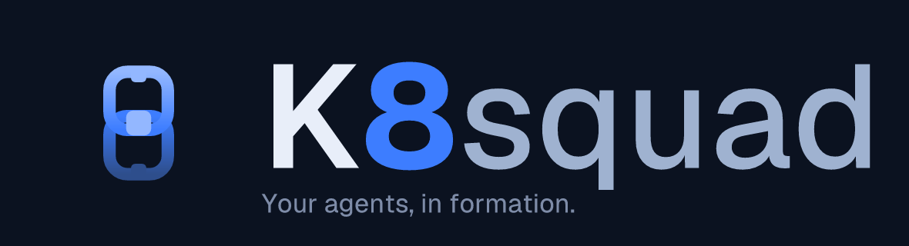
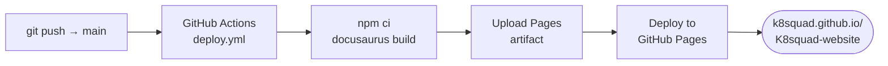

<!-- markdownlint-disable MD033 MD041 -->
<p align="center">
  <picture>
    <source media="(prefers-color-scheme: dark)" srcset="assets/brand/banner-on-dark.png">
    <source media="(prefers-color-scheme: light)" srcset="assets/brand/banner-on-light.svg">
    
  </picture>
</p>

<p align="center">
  <strong>Website and documentation for KSquad — autonomous agent squads on Kubernetes.</strong>
</p>

<p align="center">
  <a href="https://github.com/K8squad/K8squad-website/actions/workflows/deploy.yml">
    </a>
  <a href="https://github.com/K8squad/K8squad/blob/main/LICENSE">
    </a>
  <a href="https://k8squad.github.io/K8squad-website/">
    </a>
  <a href="https://github.com/K8squad/K8squad">
    </a>
</p>

---

## About

This repository holds the **public website and documentation** for KSquad — a Kubernetes-native,
agent-agnostic control plane for running a *squad* of AI agents against a shared backlog. KSquad
reconciles your squads as CRDs, coordinates agents through durable work items, and runs untrusted
agent code in isolated sandboxes, so a crew of agents becomes a first-class cluster workload instead
of a pile of scripts and API keys.

Everything that renders at **[k8squad.github.io/K8squad-website](https://k8squad.github.io/K8squad-website/)**
is built from the sources here and deployed automatically to GitHub Pages.

> **Naming:** running prose uses **"KSquad"**; the wordmark renders the stylized **"K8squad"** (the
> numeral `8` in Squad Azure `#3D7DFF` — a Kubernetes pun, like K8s ↔ Kubernetes). Both are correct;
> please don't rewrite prose "KSquad" → "K8squad".

## What's in this repo

| Area | Path | Description |
|------|------|-------------|
| **Landing page** | `content/landing.md` | Single-page marketing copy — hero, feature cards, "how it works", CTAs. |
| **Documentation site** | `docs/` | The full docs tree (Docusaurus): quickstart, concepts, operator/author/console guides, API reference, observability, troubleshooting. |
| **Plugin SDK guide** | `docs/plugin-sdk/` | Plugin overview, event reference, hello-world, and worked examples. |
| **Console screenshots** | `docs/console-guide/images/` | 20 dark-theme console captures backing the screen-by-screen walkthrough. |
| **Brand assets** | `assets/brand/` | 8-Crest logo lockups, banner wordmarks, favicon, hero art, and the "how it works" diagram. |
| **Handoff notes** | `CONTENT-NOTES.md`, `VISUAL-NOTES.md` | Content ↔ Design coordination contract (copy, branding, screenshot mapping). |

## Tech stack

| Layer | Choice |
|-------|--------|
| **Site generator** | [Docusaurus 3](https://docusaurus.io/) (React + MDX) — chosen for native `sidebar_position` support, first-class dark mode, and single-accent theming. |
| **Content format** | Framework-agnostic Markdown + YAML frontmatter (`title`, `description`, `sidebar_position`). Portable to Astro Starlight or Hugo with minimal reshaping. |
| **Styling** | Dark theme primary; single accent **Squad Azure `#3D7DFF`**; Geist Sans (UI) / Geist Mono (code, CRD YAML, Run IDs). |
| **API reference** | CRD field tables generated from the `ksquad.io/v1alpha1` Go types in the core repo at build time. |
| **CI/CD** | GitHub Actions → **GitHub Pages** (auto-deploy on push to `main`). |

> **Status:** content is authored today as portable Markdown; the Docusaurus scaffold
> (`package.json`, `docusaurus.config.js`, `src/`, `static/`) and the Pages workflow land as part of
> standing the site up. The commands and pipeline below describe that target setup.

## Local development

```bash
# 1. Install dependencies (Node.js 18+)
npm ci

# 2. Start the dev server with hot reload → http://localhost:3000
npm start

# 3. Build the static site into ./build
npm run build

# 4. Preview the production build locally
npm run serve
```

Prefer editing content directly? Every page under `docs/` and `content/` is plain Markdown — open it
in any editor. Internal links are relative, so they resolve the same in your editor preview and on the
live site.

## Structure

```text
K8squad-website/
├── content/
│   └── landing.md              # Landing-page copy (hero, features, CTAs)
├── docs/                       # Documentation content (Markdown + frontmatter)
│   ├── index.md                # Docs home
│   ├── quickstart.md           # Empty cluster → first squad in < 30 min
│   ├── concepts/               # Squads, Agents, Roles, Skills, Projects, Runs
│   ├── operator-guide/         # Install, configuration, credentials, RBAC, settings
│   ├── author-guide/           # Compose CRDs, manage work items
│   ├── console-guide/          # Screen-by-screen walkthrough + images/
│   ├── api-reference/          # CRD reference (auto-generated from Go types)
│   ├── observability/          # OTelConfig, metering, dashboards, tracing
│   ├── plugin-sdk/             # Plugin overview, events, hello-world, examples
│   └── troubleshooting.md
├── assets/
│   └── brand/                  # Logo lockups, banner, favicon, hero art, diagrams
├── CONTENT-NOTES.md            # Content → Design handoff contract
├── VISUAL-NOTES.md             # Design → Content handoff contract
└── README.md
```

The Docusaurus scaffold adds `src/` (custom React pages/components) and `static/` (served assets)
alongside the content above.

## Deployment

Pushes to `main` are built and published to GitHub Pages automatically — there is no manual publish
step.



Pull requests get a build check but do not deploy; only `main` publishes to production.

## Contributing

Documentation and website changes are welcome. Please read the core project's
**[CONTRIBUTING.md](https://github.com/K8squad/K8squad/blob/main/CONTRIBUTING.md)** for the
contribution workflow, DCO/sign-off, and code of conduct.

Content-specific guidelines for this repo:

- **Voice:** end-user voice only — no internal issue numbers, planning jargon, or process references.
- **Accuracy:** copy follows the *real* UI and the `v1alpha1` API. If a screenshot or field drifts,
  fix the copy to match the product, not the other way around.
- **Structure:** every page needs `title`, `description`, and `sidebar_position` frontmatter; use
  relative internal links.
- **Branding:** keep the wordmark stylized (**K8squad**) and prose as **KSquad**; single accent
  `#3D7DFF`; no AI-purple gradients or default Inter. Full contract in
  [`CONTENT-NOTES.md`](./CONTENT-NOTES.md) and [`VISUAL-NOTES.md`](./VISUAL-NOTES.md).

Copy is owned by the Content Writer; hero art, logo lockups, and finalized screenshots are owned by
the Graphic Designer — the two handoff files above are the coordination contract.

## Links

- **Core repository:** [github.com/K8squad/K8squad](https://github.com/K8squad/K8squad)
- **Live docs:** [k8squad.github.io/K8squad-website](https://k8squad.github.io/K8squad-website/)
- **Contributing:** [CONTRIBUTING.md](https://github.com/K8squad/K8squad/blob/main/CONTRIBUTING.md)
- **License:** [Apache 2.0](https://github.com/K8squad/K8squad/blob/main/LICENSE)

---

<p align="center">
  <sub>© K8squad · Licensed under the Apache License 2.0 · Built with Docusaurus, deployed on GitHub Pages.</sub>
</p>
